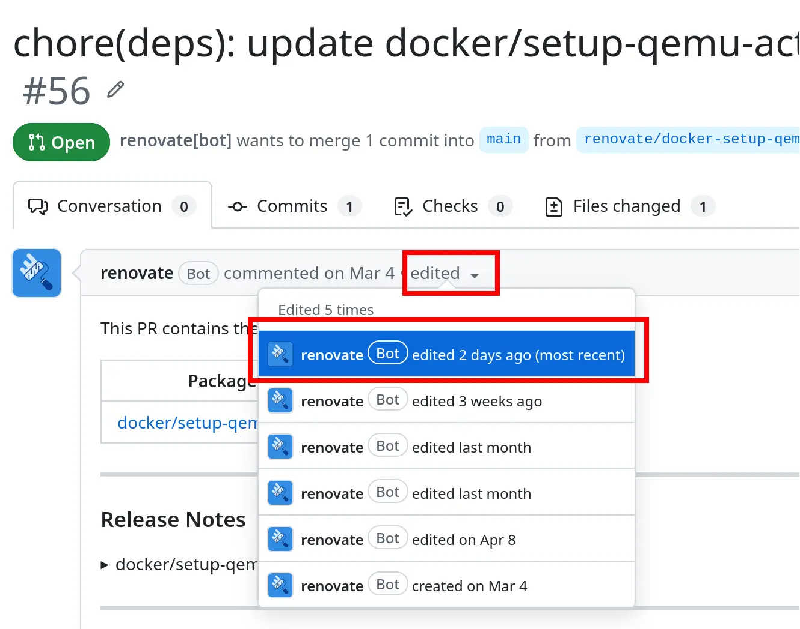

# Navigator instructions

## Preparation work: set up your VSCode Live client

At the end of the intro slide presentation, you were given a piece of paper with an anonymous number and a link to a _Google Doc_. That Google doc contained the link to this GitHub repo. Keep the browser tab with this `README-mob-navigator.md` file open throughout the workshop.

Every mob participant needs a VSCode Live Share _client_ so that they can help the driver (by sending them code snippets).

Choose _one_ of the following approaches

- **Browser-based** client (recommended):
  - Open the _VSC Live Share_ link shown in the _Google Doc_, it's recommended to do this in a **private** browser window
  - Click "Continue in web"
  - In the bottom right corner, click on "Continue as anonymous"
  - In the dialog at the top, type in your username: **use the number printed on the paper given to you**
  - After a short moment, you should see the files of the project
- **Local VS Code installation:**
    - If you prefer to use your _local_ VS Code installation (e.g., because you want to use your keyboard shortcuts), and if you can live with the disadvantage that you might not be able to join _anonymously_:
    - In VS Code, make sure you have the "Live Share" extension installed
    - Open the VS Code command palette and select `Live Share: Join Collaboration Session` and paste the link shown in the Google Doc

Note: once it is your turn to be the **driver**, follow the [README-mob-driver.md](README-mob-driver.md) instructions.

## Task 0: Onboarding the Renovate _app_

Help the driver with granting the cloud-hosted Renovate App access to the prepared GitHub repo-copy.

- Wait until the driver confirms that their VNC connection works
- Tell the driver to open **link 1** (https://github.com/apps/renovate), then do the following:
  - (Note: if asked for the GitHub password, the instructor will help you with this)
  - In the very top-right corner of the page, click **Install** (or **Configure**)
  - Select the _GitHub organization_ of the repo-copy (same as the GitHub username)
  - Choose _Only select repositories_ and select the repo-copy
  - Click **Install** (or **Save**)
  - The driver will be redirected to https://developer.mend.io/install:
      - For the **product**, choose "Renovate only"
      - For the **mode**, choose "Scan and alert"
      - Click _Finish_

## Task 1: Renovate _repository onboarding_

After granting the GitHub Renovate app access to the repo-copy, Renovate creates an _onboarding PR_ named "Configure Renovate" in the repo.

Tell the driver to open it, and look at it together.

Tell the driver that the goal of this PR is
- to allow us to _tune_ the Renovate-config for this repo
- to provide us with a _preview_ of the PRs Renovate will create, once we merge this Onboarding PR. This protects the repo from a flood of unwanted/accidental dependency-update-PRs.

Confirm together with the driver that the _PR description_ contains the following sections:
- **Detected Package Files**
  - Shows in which files the different [managers](https://docs.renovatebot.com/modules/manager/) (such as `npm`) found various dependencies.
  - _Managers_ are Renovate's _file parsers_ that find pinned dependencies in your repository. Each manager knows which files to look for (e.g. `requirements.txt` for manager `pip_requirements`), and can parse their internal structure, to identify dependencies.
- **Configuration Summary**
  - Lists how Renovate is configured.
  - Renovate has dozens of detailed configuration options. Tell the driver to open **link 2** (https://docs.renovatebot.com/configuration-options/) and ask them to briefly scroll through the configuration list, to get a glimpse.
  - The PR lists many applied configurations, but we did not really do anything yet! To understand this, we need to examine this PR's contents, tell the driver to look at the changed files.
  - Renovate only added a repo-specific configuration file, `renovate.json`. It tells Renovate how to behave for that repo. You see that `renovate.json` only `extends` the `"config:recommended"` preset. It is one of many configuration presets baked into Renovate, it causes all these predefined configurations.
- **What to expect**
  - Lists all Dependency-update PRs that Renovate will (ultimately) create.
  - At the bottom, it also mentions an _hourly limit_!

We now tune the Renovate config together:
- Tell the driver to run `git checkout renovate/configure` in a terminal of the VSCode Live Share session (within the VNC-remote-control). The `renovate.json` file should appear in the repo root.
- In the `renovate.json` file, replace `"config:recommended"` with `"config:best-practices"`, to get even better defaults
- Add the [:disableRateLimiting](https://docs.renovatebot.com/presets-default/#disableratelimiting) preset to `extends` (by adding a `":disableRateLimiting"` entry to it) , so that Renovate creates _all_ dependency-update PRs at once (rather than in batches)
- We want to teach Renovate to detect `FROM base-image:tag` dependencies also in `Earthfile`s, not just `Dockerfile`s:
  - Reason: an `Earthfile` also contains `FROM base-image:tag` statements.
  - Renovate already has a [dockerfile manager](https://docs.renovatebot.com/modules/manager/dockerfile/), but it only looks for `Dockerfile`s, hence we need to tune it.
  - Tell the driver to open **link 3** ([see here](https://docs.renovatebot.com/modules/manager/#extending-a-managers-default-managerfilepatterns)). This example explains how to tweak Renovate's `dockerfile` manager. You need to replace `"does-not-look-like-a-docker-file"` with the glob-pattern `"**/Earthfile"`.
- Tell the driver to run `git add/commit/push` commands to get these changes to GitHub
- 1-2 minutes later, observe how Renovate changed the description of the Onboarding PR. Together with the driver, verify that the _Configuration summary_ section shows more configurations, and the _hourly limit_ notice has disappeared, and the _Detected Package Files_ show the `Earthfile`s. You can also look at the PR Description _diff_, as illustrated here: 
- Tell the driver to **merge** the Onboarding PR.
- Shortly afterward, you will see the Dependency-update-PRs appear. Look at one of the PRs together with the driver. Notice the detailed information and the provided _Release notes_
- Once Renovate created _all_ PRs (approx. 40 PRs), the _Issues_ tab of the GitHub repo will show a "Dependency dashboard" issue. Look at that "Dependency dashboard" issue with the driver

## Task 2: Adding labels to Renovate PRs

> One navigator reads out loud:
>
> Right now we have a large number of PRs, all of them from Renovate. In the real world, your team also creates their own PRs. You might have a hard time finding them in the large mass of Renovate PRs. A common solution is to tell Renovate to add _labels_ to PRs, because that allows you to filter for PRs.

Instructions for the driver:
- In the Live-Share-Terminal in the VNC session, run `git checkout main` and `git pull` to reflect the changes done by merging the Onboarding PR
- Modify the `renovate.json` by adding this section:
`"labels": ["dependency-update", "deptype:{{manager}}", "updatetype:{{updateType}}"]`
- Commit and push the changes.

> One navigator reads out loud:
>
> In the next 1-2 minutes, Renovate will add three labels to each PR:
> - one with the _static_ value `dependency-update`
> - two labels with _dynamic_ value, using template fields. This is useful information to have, because the _PR title_ alone (e.g., _"Update dependency MarkupSafe to v3"_) often lacks information. Here, `"deptype:{{manager}}"` indicates where the dependency is declared/found. And `"updatetype:{{updateType}}"` indicates whether it's a major/minor/patch update.

- Tell the driver to go to the list of PRs
- Look at the "Update **kafka** Docker tag to v32" PR. One would think it's about a `Dockerfile` update, but the label tells us that it was really affecting a _Helm chart_
- Click on any _label_ to filter PRs. For instance, click on `deptype:pip_requirements` to only see PRs that update Python/pip dependencies.
- While filtering, in the **Filters** text field, you can add a `-` in front of a label filter (e.g., `-label:deptype:npm`) to _hide/exclude_ PRs with that label. Try this together with the driver.

## Task 3: Grouping dependency updates

> One navigator reads out loud:
>
> We currently have _many_ PRs (over 40). The advantage is that we immediately see the CI pipeline status for each individual dependency update, indicating potentially breaking changes. But the disadvantage is that merging each PR individually will be a lot of work. Often, multiple dependencies need to be updated together anyway (if you updated just one, the build or test would break). Depending on your GitHub notification settings, you would also get a lot of notification spam (emails) if you always have individual PRs for every dependency.
>
> We will now configure Renovate's **grouping** feature, telling Renovate to bundle several dependencies into a single PR, based on **rules** that we define. The feature is called `packageRules`. The `packageRules` key in the `renovate.json` file lets you fine-tune / override the Renovate’s behavior for specific dependencies. Selecting these dependencies is done via the **matchXXXX** keys, e.g., **matchFileNames**, **matchPackagePatterns** or **matchUpdateTypes**.
> 
> `packageRules` is an array of (JSON) objects, where each object must have:
> - one or more of the **matchXXXX** sub-keys explained in the [packagesRules documentation](https://docs.renovatebot.com/configuration-options/#packagerules) (such as **matchPackageNames**)
> - one or more of "regular" configuration options documented on the Configuration Options page, e.g., [automerge](https://docs.renovatebot.com/configuration-options/#automerge), [enabled](https://docs.renovatebot.com/configuration-options/#enabled), or [groupName](https://docs.renovatebot.com/configuration-options/#groupname)
>
> We now want to create a `packageRules` entry to group all **Python** dependency updates.

Instructions for the driver:
- Tell the driver to open **link 4** (https://docs.renovatebot.com/configuration-options/#groupname), scrolling down a bit shows an example snippet for `packageRules`. The driver needs to copy that snippet into the `renovate.json` file, omitting the first `{` and last `}` character.
- Adapt the snippet: regarding **matchXXXXX** we only need `matchCategories`. It is an array of strings matching the _category_ of _managers_, e.g., `java`, `node` or `python`.
- Update the `groupName` to a string of your choice, e.g., "python". This string will appear in the PR title in place of the concrete dependency names, i.e., the PR title will have the form `Update <groupName>`.
- Commit and push the changes.
- After 1-2 minutes, verify together with the driver that the number of PRs has decreased. Take a look at the _closed_ PRs. Renovate automatically closed all the _individual_ Python-related PRs and instead created _two_ new PRs:
  - One PR contains all Python dependencies with minor/patch updates
  - One PR contains all Python major updates

> One navigator reads out loud:
>
> FYI, this default behavior of Renovate (to create two PRs instead of one) _could_ be changed. There are various configuration options named "separateXXXX", e.g., [separateMajorMinor](https://docs.renovatebot.com/configuration-options/#separatemajorminor) that we could tune. Renovate's [FAQ](https://docs.renovatebot.com/faq/#renovates-default-behavior-for-majorminor-releases) provides more details. However, we'll leave it at the default behavior.

## Task 4: Automatic merging of Renovate PRs

> One navigator reads out loud:
>
> Assuming that you have extensive test coverage, it makes sense to allow Renovate to automatically merge PRs, given that the CI pipeline passes. However, it makes sense to first **configure _realistic_ (real-world) PR-merge settings** in our repo-copy. We should protect the `main` branch, forcing all changes to be done via PRs whose branches are up-to-date regarding `main`. We will now implement this.

Instructions for the driver:
- Go to your repo's **Settings** tab, and then Go to **Rules -> Rulesets** and create a new **Branch rule set** with the following settings:
  - _Ruleset name_: Anything you want, e.g., "Protect main"
  - _Enforcement status_: Active
  - _Bypass list_: Add yourself (e.g. "Repository admin"), just for this workshop, to allow yourself to push changes you make to `renovate.json` directly to `main`, without a PR
  - _Target branches_: add the "default branch"
  - In _Branch rules_:
      - Check "Require a pull request before merging"
      - Check "Require status checks to pass". In its _Additional settings_, check "Require branches to be up to date before merging". Add the "run-tests" check to the list of required checks (in the dropdown that shows when you click on "Add checks", type "test" and wait for the auto-complete to suggest "run-tests")
- Click _Create_
- Update the `renovate.json` file, adding another object inside `packageRule` that sets `"automerge": true` for updates made to `Dockerfiles` of type _minor_. Hint: you will need `matchUpdateTypes` and `matchManagers`.
- Commit and push the changes to `main` directly.
- Wait 1-2 minutes for Renovate to update PRs
- Together with the driver, verify that those PRs with `deptype:dockerfile` and `updatetype:minor` labels have updated _PR descriptions_ which now mention that the PRs will be automatically merged, while PRs with different labels (e.g., `deptype:dockerfile` and `updatetype:major`) have unchanged descriptions.

> One navigator reads out loud:
>
> Even though Renovate updated the PR descriptions, Renovate did not merge any PRs. The reason is that Renovate follows this process when it **visits** your repo:
> - Step 1: Renovate **rebases** those existing Renovate-PRs that are out of date (regarding `main`) and thus need to be rebased, because of our branch ruleset
> - Step 2: Renovate clicks on the "Merge" button for us (via API call), but only for **one** auto-mergeable PR per visit, and only if this PR did not need rebasing to begin with, and only if its CI (status checks) had already passed. In other words, PRs rebased _just now_ in step 1 are _not_ in scope for step 2 in the current visit/run.
>
> Let's see auto-merge (of one PR) in action.

Instructions for the driver:
- Open the PR list, filter for PRs with labels `deptype:dockerfile` and `updatetype:minor`
- Make sure that for at least one of these PRs, the CI pipeline (status check) has already passed successfully (it has green checkmark)
- Go to the _Dependency dashboard_ issue and check the checkbox at the very bottom of the issue description, to trigger another Renovate visit
- About one minute later, observe that Renovate merged one of the Dockerfile update PRs.

> One navigator reads out loud:
>
> In summary, auto-merging PRs this way is quite time-consuming, especially if you use Renovate's hosted app which only visits "inactive" repos (without activity on `main`) every 2-12 hours (depending on Mend's available resources).
>
> In practice, to get a higher throughput of auto-merging PRs, use GitHub's _Merge queue_ feature. Renovate supports GitHub's merge queue. A merge queue exists to solve the problem of dealing with many PR-merges per day. It avoids that developers (or Renovate itself) have to manually / repeatedly rebase branches, wait for the CI to pass and then click "merge". You can try out the Merge Queue feature at home.

## Task 5: Detecting versions in unsupported files

> One navigator reads out loud:
> 
> We want to teach Renovate to scan the `.github/workflows/ci.yml` and detect the _Earthly_ version defined in the `with: version: ...` block of the `earthly/actions/setup-earthly@v1` action:
> ```
> - uses: earthly/actions/setup-earthly@v1
>   with:
>     version: v0.7.9  # << we want Renovate to update this version
> ```
> Renovate lets us define "custom managers" and we will use the JSONata custom manager, which can also parse YAML files.

Instructions for the driver:
- Add the following entry to `renovate.json`:
  ```json
    "customManagers": [
      {
        "customType": "jsonata",
        "fileFormat": "yaml",
        "managerFilePatterns": [".github/workflows/ci.yml"],
        "matchStrings": [
          "jobs.*.steps[$contains(uses, \"earthly/actions/setup-earthly@\")].with.{ \"depName\": earthly/earthly\", \"currentValue\": version, \"datasource\": \"github-tags\" }"
        ]
      }
    ]
  ```
- Commit and push the changes directly to `main`
- After 1-2 minutes, Renovate will create a new PR that updates the Earthly version action.

## Congratulations

You completed the tasks of this workshop. 🚀

There is a lot more material. Renovate maintains an official [reading list](https://docs.renovatebot.com/reading-list/). Marius also blogged extensively, see [this blog post](https://www.augmentedmind.de/2023/07/30/renovate-bot-introduction/) for a Renovate introduction, with many links to advanced techniques and a cheat sheet.

The [README-selfpaced.md](README-selfpaced.md) contains more background material, in case you want to repeat the workshop at home.

Remember that _technically introducing Renovate_ is only a small fraction of the work necessary. Changing your team culture and your paying, non-technical stakeholders is the bigger challenge.
